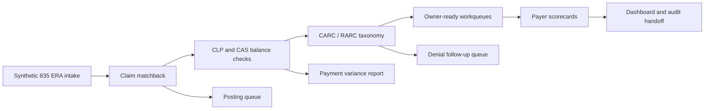

# RevCycleMGMT Remit And Denial Ops


This repository is a public proof package for RevCycleMGMT's post-adjudication operating layer. It turns synthetic 835 remit lines into claim matchback, payment variance, CARC/RARC root-cause queues, payer scorecards, audit logs, and dashboard-ready output.

The buyer signal is simple: when payment or denial files arrive, the practice should not be left with raw remit noise. The workflow should tell the team what paid, what underpaid, what denied, who owns the fix, and which payer behavior needs leadership attention.

## What This Proves

| Proof area | What the repo demonstrates | Buyer value |
| --- | --- | --- |
| 835 remit matchback | Synthetic remit lines are normalized and tied back to claim IDs. | Posting and follow-up teams can see claim-level outcomes instead of disconnected payment fragments. |
| Payment variance | Allowed, paid, contractual, patient responsibility, and remaining gap values are separated. | Underpayment, contractual adjustment, and patient-balance work do not collapse into one vague bucket. |
| Denial routing | CARC/RARC codes map to owner-ready queues such as claim correction, authorization follow-up, and medical necessity review. | Billing, front desk, evidence, and posting ownership becomes visible. |
| Payer scorecards | Payers are ranked by denial count, variance exposure, paid amount, and remit lag. | Small practices can see which routes create revenue drag. |
| Local control room | A Streamlit console presents metrics, queue detail, payer behavior, 835 preview, and audit events. | The proof can be inspected locally without production data or external services. |

## Workflow



## Transaction And Operations Coverage

| Layer | Included now | Output artifact |
| --- | --- | --- |
| 835 ERA | Synthetic CLP/CAS-style payment and adjustment preview | `output_demo/835_preview.edi` |
| Claim matchback | Claim ID, payer, trace number, remit status, service/remit timing | `output_demo/reconciled_remits.json` |
| CARC/RARC taxonomy | CO, PR, and RARC examples mapped to root cause, owner, queue, and action | `samples/carc_rarc_taxonomy.csv` |
| Denial operations | Claim correction, documentation follow-up, authorization follow-up, medical necessity review | `output_demo/denial_workqueues.json` |
| Variance operations | Allowed vs paid gap, patient responsibility, contractual adjustment, denial exposure | `output_demo/remit_metrics.json` |
| Payer monitoring | Denial rate, payment variance, paid amount, average days to remit, top root cause | `output_demo/payer_scorecard.json` |
| Audit trail | Synthetic matchback and workqueue routing events | `output_demo/audit_log.json` |

See [docs/x12-api-remit-workflow.md](docs/x12-api-remit-workflow.md) for the vendor-neutral X12/API alignment boundary used by this repo.

## Local Quickstart

```bash
python3 -m venv .venv
source .venv/bin/activate
pip install -e ".[app,test]"
PYTHONPATH=src python3 -m revcyclemgmt_remit_denial.ops \
  samples/835_remit_lines.json \
  samples/carc_rarc_taxonomy.csv \
  --out output_demo
pytest -q
```

Expected CLI summary:

```json
{
  "metrics": {
    "remit_lines": 6,
    "total_allowed": 1360.0,
    "total_paid": 870.0,
    "total_payment_variance": 450.0,
    "total_denial_exposure": 410.0,
    "denied_count": 2,
    "denial_rate": 0.333,
    "queue_count": 6,
    "average_days_to_remit": 6.3
  },
  "queue_count": 6,
  "payer_count": 4
}
```

## Run The Local Console

```bash
streamlit run apps/remit_denial_console.py
```

The console opens with six synthetic remit scenarios and lets you inspect:

| Tab | Purpose |
| --- | --- |
| Control Room | Reconciled remit table, KPIs, and queue exposure chart |
| Workqueues | Queue ownership and claim-level denial details |
| Payer Scorecard | Payer behavior ranked by payment variance and denial exposure |
| 835 Preview | Synthetic X12-style 835 output for implementation demonstration |
| X12/API Flow | Vendor-neutral workflow mapping for ERA retrieval, reconciliation, and dashboard handoff |
| Audit Log | Synthetic event trail for matchback and routing actions |

## Sample Denial Routing

| Claim | Payer | Codes | Routed queue | Owner | Action |
| --- | --- | --- | --- | --- | --- |
| `SYN-CLAIM-9002` | Synthetic Payer B | `CO-16`, `M51` | Claim correction | billing lead | Correct missing claim information and resubmit. |
| `SYN-CLAIM-9005` | Synthetic Payer B | `CO-197`, `N115` | Authorization follow-up | front desk lead | Confirm authorization record and appeal or rebill when supported. |
| `SYN-CLAIM-9006` | Synthetic Payer D | `CO-50`, `N620` | Medical necessity review | evidence owner | Review documentation support and payer policy. |

## Repository Layout

```text
apps/remit_denial_console.py              # Streamlit proof console
samples/835_remit_lines.json              # Synthetic remit scenario
samples/carc_rarc_taxonomy.csv            # Synthetic CARC/RARC routing table
src/revcyclemgmt_remit_denial/ops.py      # Reconciliation and workqueue engine
output_demo/                              # Generated proof artifacts
tests/test_ops.py                         # Unit tests for matchback, metrics, routing, and artifacts
docs/website-card-copy.md                 # Portfolio card copy
docs/x12-api-remit-workflow.md            # Clearinghouse/API remit alignment notes
COMPLIANCE.md
SECURITY.md
```

## Public Safety Boundary

This is a synthetic proof repository. It does not contain PHI, production 835 files, payer credentials, clearinghouse credentials, client payment files, live API tokens, or payer contract terms.

Production implementation would require secure access controls, agreements, companion-guide validation, payer-specific posting rules, contract review, audit logging, retention controls, and client approval before touching live healthcare data.

## Status

This repo is ready for public portfolio use as a proof-of-concept. It is not represented as a production posting system.
